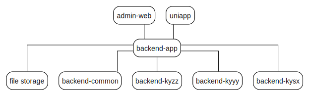

# Pipker Do

<p align="center">
  <strong>One learning platform, two clients, three exam domains.</strong>
  <br />
  Build, operate, and deliver a postgraduate exam-prep product from a single repository.
</p>

<p align="center">
  <a href="./README.md">English</a>
  ·
  <a href="./README.zh-Hans.md">简体中文</a>
</p>

<p align="center">
  
  
  
  
  
  
</p>

## Table of Contents

- [Introduction](#introduction)
- [Why Pipker Do](#why-pipker-do)
- [Product Surface](#product-surface)
- [Architecture](#architecture)
- [Tech Stack](#tech-stack)
- [Getting Started](#getting-started)
- [Project Structure](#project-structure)
- [Existing Docs](#existing-docs)
- [Roadmap Notes](#roadmap-notes)

## Introduction

Pipker Do is a full-stack monorepo for a postgraduate entrance exam preparation product.  
The current repository already brings together:

- A Spring Boot 4 multi-module backend
- A Vue 3 admin console for operations and management
- A uni-app WeChat Mini Program for end users
- Three domain tracks:
  - `kyzz` for politics
  - `kyyy` for English
  - `kysx` for mathematics

From the existing code and directory structure, the platform is already organized around question banks, practice sessions, exam flows, rankings, favorites, wrong-book review, user profile management, storage, authentication, project switching, and selected AI-related capabilities.

## Why Pipker Do

Most education products split learning, operations, and domain content into disconnected projects.  
Pipker Do keeps them in one repository and one delivery model:

- One backend for shared identity, storage, config, and business orchestration
- One admin console for configuration and operations
- One mini-program client for real user learning flows
- Three exam domains managed as independent business modules instead of mixed feature sprawl

This structure is already visible in the repository today and makes the product easier to evolve without losing domain boundaries.

## Product Surface

### For learners

- Question bank browsing
- Practice and exam flows
- Favorites and wrong-book review
- Leaderboards and profile-related pages
- English-specific pages including reading, translation, composition, word bank, and AI practice

### For operators

- Admin-side login and project switching
- Business modules grouped by subject domain
- Shared backend modules for account, auth, config, project, storage, and admin capabilities

### For the engineering team

- Multi-module backend instead of a single overloaded service
- Separate web admin and mini-program clients
- Clear domain partitioning for `kyzz`, `kyyy`, and `kysx`
- Shared infrastructure for auth, file storage, rate limiting, and runtime config

## Architecture



## Tech Stack

### Backend

- Java `17`
- Spring Boot `4.0.5`
- Maven multi-module
- MyBatis-Plus
- Sa-Token
- Redis integration
- MySQL datasource configuration
- OpenAI Java SDK present in dependency management

### Admin Web

- Vue `3`
- Vite
- TypeScript
- Element Plus
- Pinia
- Axios

### Mobile Client

- uni-app
- WeChat Mini Program target

## Getting Started

### Backend

Verified from the current repository:

- Main class: `org.example.backend.BackendApplication`
- Default port: `8080`
- Default Spring profile: `dev`
- Example local config file: `backend/backend-app/src/main/resources/application-dev.example.yml`

Run locally:

```bash
cd backend
mvn spring-boot:run -pl backend-app
```

Before starting, review and localize:

- MySQL datasource
- Redis connection
- Local file storage path
- WeChat Mini Program credentials
- LLM config secret

### Admin Web

Verified from `admin-web/package.json` and `.env.development`:

- API base path: `/api`
- Proxy target: `http://localhost:8080`

Run locally:

```bash
cd admin-web
npm install
npm run dev
```

Build:

```bash
npm run build
```

### Uni-App

Verified from the current repository:

- `uniapp/App.vue`
- `uniapp/main.js`
- `uniapp/pages.json`
- `uniapp/manifest.json`

Open `uniapp/` in HBuilderX or your existing uni-app workflow and run it against the WeChat Mini Program target.

## Project Structure

```text
pipker-do/
├── admin-web/      # Vue admin console
├── backend/        # Spring Boot multi-module backend
│   ├── backend-app
│   ├── backend-common
│   ├── backend-kyyy
│   ├── backend-kysx
│   └── backend-kyzz
├── uniapp/         # uni-app WeChat Mini Program
├── rules/          # collaboration and architecture rules
├── 有关文档/        # product and design documents
└── file/           # local upload/runtime files
```

### Backend Modules

- `backend-app`: application entry and runtime configuration
- `backend-common`: shared auth, account, admin, project, config, storage, and LLM-related modules
- `backend-kyzz`: politics business domain
- `backend-kyyy`: English business domain
- `backend-kysx`: mathematics business domain

### Admin Modules

- `system`: login, dashboard, project switching, admin shell
- `kyzz`: politics operations module
- `kyyy`: English operations module
- `kysx`: mathematics module scaffold currently present in structure

### Mini Program Pages

- `pages/common`: shared cross-business pages
- `pages/kyyy`: English learning and practice pages
- `pages/kyzz`: politics learning and practice pages

## Existing Docs

- [rules/README.md](/Volumes/HARDDRIVE1/project/private/pipker-do/rules/README.md)
- [rules/common.md](/Volumes/HARDDRIVE1/project/private/pipker-do/rules/common.md)
- [admin-web/README.md](/Volumes/HARDDRIVE1/project/private/pipker-do/admin-web/README.md)
- [uniapp/README_STRUCTURE.md](/Volumes/HARDDRIVE1/project/private/pipker-do/uniapp/README_STRUCTURE.md)
- [有关文档/页面功能描述.md](/Volumes/HARDDRIVE1/project/private/pipker-do/%E6%9C%89%E5%85%B3%E6%96%87%E6%A1%A3/%E9%A1%B5%E9%9D%A2%E5%8A%9F%E8%83%BD%E6%8F%8F%E8%BF%B0.md)
- [有关文档/管理员管理设计.md](/Volumes/HARDDRIVE1/project/private/pipker-do/%E6%9C%89%E5%85%B3%E6%96%87%E6%A1%A3/%E7%AE%A1%E7%90%86%E5%91%98%E7%AE%A1%E7%90%86%E8%AE%BE%E8%AE%A1.md)
- [有关文档/上线流程.md](/Volumes/HARDDRIVE1/project/private/pipker-do/%E6%9C%89%E5%85%B3%E6%96%87%E6%A1%A3/%E4%B8%8A%E7%BA%BF%E6%B5%81%E7%A8%8B.md)

## Roadmap Notes

This README is intentionally product-forward, but the wording is still constrained to facts verified from the current repository.

The following items are still `TODO` or should be confirmed before being added as stronger product claims:

- Public production deployment link
- Official screenshots and product branding assets
- License statement
- Contribution process
- Release workflow
