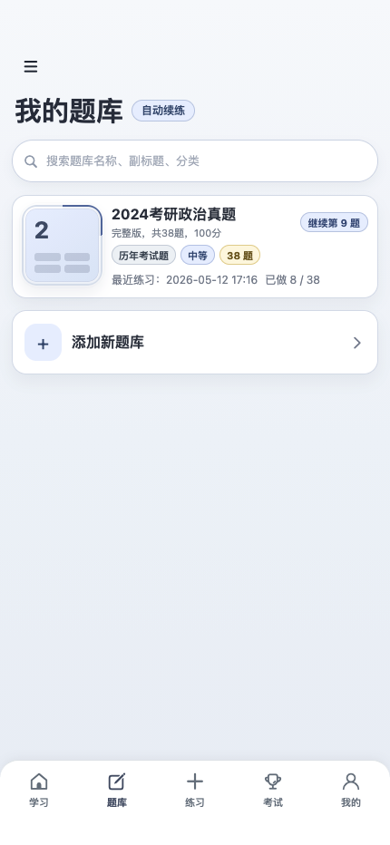
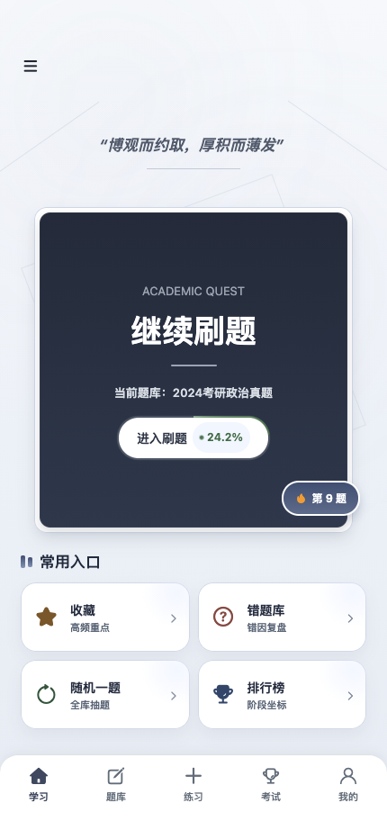
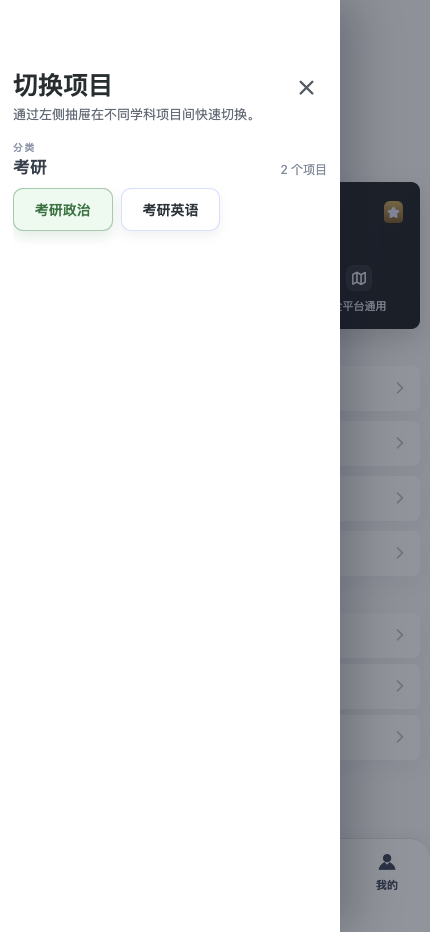
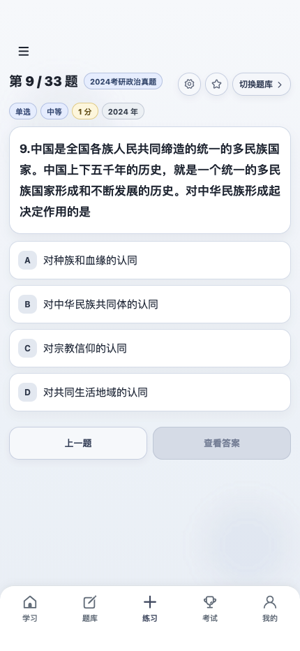
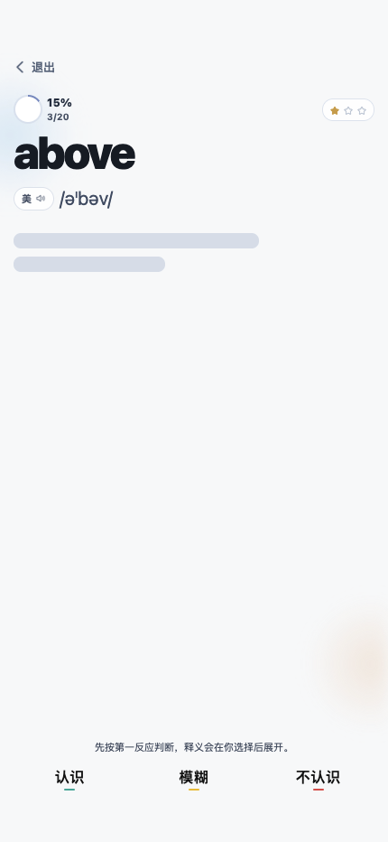
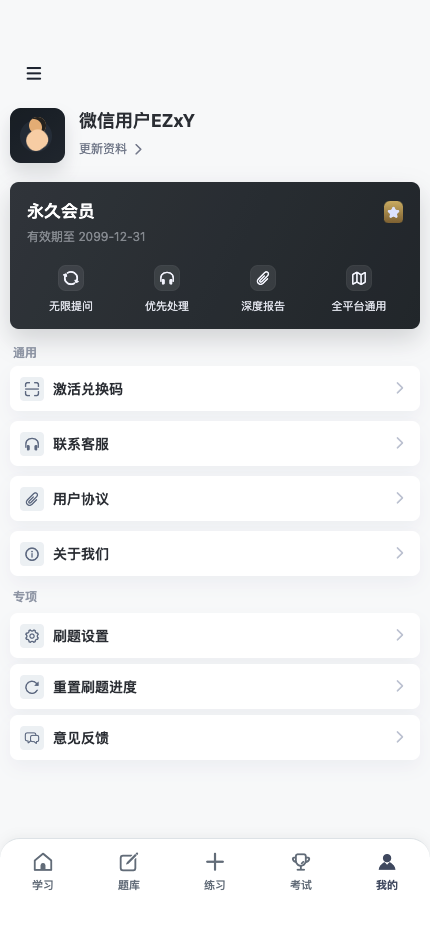
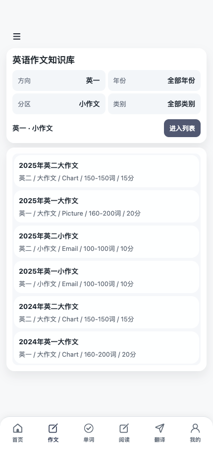
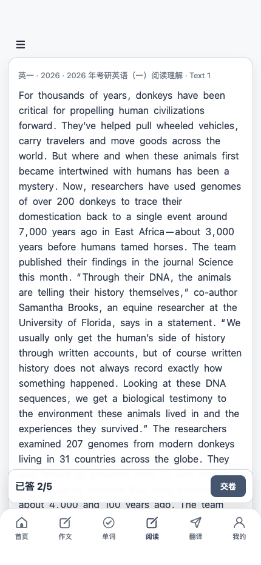
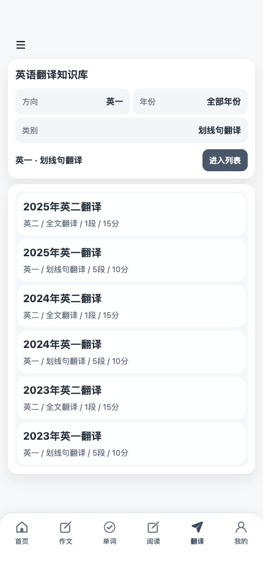
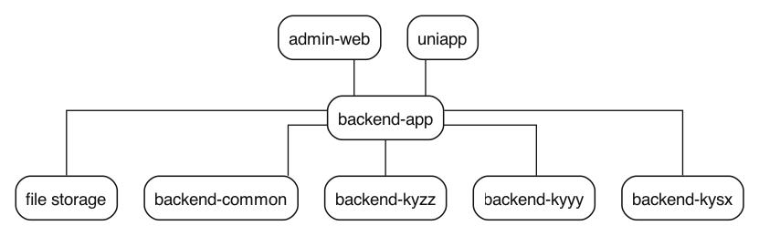

# Pipker Do

<p align="center">
  <strong>一个仓库，覆盖学习端流程、运营端流程与三个考研业务域。</strong>
  <br />
  Spring Boot 后端、Vue 管理后台和 uni-app 小程序端统一放在同一套单仓库里。
</p>

<p align="center">
  <a href="./README.md">English</a>
  ·
  <a href="./README.zh-Hans.md">简体中文</a>
</p>

<p align="center">
  
  
  
  
  
</p>

## 功能概览

- Spring Boot 4 多模块后端
- Vue 3 运营管理后台
- uni-app 微信小程序端
- 三个考研业务域：
  - `kyzz`：考研政治
  - `kyyy`：考研英语
  - `kysx`：考研数学

当前仓库已经包含题库、练习、考试、排行榜、收藏、错题回顾、个人资料、文件存储、鉴权与项目切换等相关代码和文档。

## 截图

以下图片均来自仓库当前的 `image/` 目录。

| 我的题库页 | 继续刷题 | 切换项目抽屉 |
| --- | --- | --- |
|  |  |  |

| 刷题答题页 | 英语单词学习页 | 会员中心页 |
| --- | --- | --- |
|  |  |  |

| 作文知识库页 | 阅读练习页 | 翻译知识库页 |
| --- | --- | --- |
|  |  |  |

## 系统架构



## 技术栈

### 后端

- Java `17`
- Spring Boot `4.0.5`
- Maven 多模块
- MyBatis-Plus
- Sa-Token
- Redis 集成
- MySQL 数据源配置
- 依赖管理中已存在 OpenAI Java SDK

### 管理后台

- Vue `3`
- Vite
- TypeScript
- Element Plus
- Pinia
- Axios

### 小程序端

- uni-app
- 微信小程序目标平台

## 配置说明

| 项目 | 值 | 说明 |
| --- | --- | --- |
| 后端端口 | `8080` | 仓库里默认的 Spring Boot 端口 |
| Spring Profile | `dev` | 默认运行环境 |
| 管理后台 API 基础路径 | `/api` | 开发环境代理到 `http://localhost:8080` |
| 后端配置模板 | `backend/backend-app/src/main/resources/application-dev.example.yml` | 本地示例配置 |
| 图片压缩配置 | `storage.image-compression` | 出现在后端应用配置中 |

## 快速开始

### 后端

已从仓库中确认：

- 启动类：`org.example.backend.BackendApplication`
- 默认端口：`8080`
- 默认 Spring Profile：`dev`
- 示例本地配置：`backend/backend-app/src/main/resources/application-dev.example.yml`

本地运行：

```bash
cd backend
mvn spring-boot:run -pl backend-app
```

启动前请先确认这些本地配置：

- MySQL 数据源
- Redis 连接
- 本地文件存储路径
- 微信小程序凭据
- LLM 配置密钥

### 管理后台

已从 `admin-web/package.json` 和 `.env.development` 确认：

- API 基础路径：`/api`
- 开发代理目标：`http://localhost:8080`

本地运行：

```bash
cd admin-web
npm install
npm run dev
```

构建：

```bash
npm run build
```

### uni-app 小程序

当前仓库里已有以下入口文件：

- `uniapp/App.vue`
- `uniapp/main.js`
- `uniapp/pages.json`
- `uniapp/manifest.json`

使用 HBuilderX 或现有的 uni-app 工作流打开 `uniapp/`，即可运行到微信小程序目标平台。

## 开发

```bash
cd backend
mvn test

cd admin-web
npm run build

cd backend
mvn spring-boot:run -pl backend-app
```

## 项目结构

```text
pipker-do/
├── admin-web/      # Vue 管理后台
├── backend/        # Spring Boot 多模块后端
│   ├── backend-app
│   ├── backend-common
│   ├── backend-kyyy
│   ├── backend-kysx
│   └── backend-kyzz
├── image/          # 本地截图与架构素材
├── uniapp/         # uni-app 微信小程序
├── rules/          # 协作与架构规则
├── 有关文档/        # 产品与设计文档
└── file/           # 本地上传/运行文件
```

### 后端模块

- `backend-app`：应用启动入口与运行配置
- `backend-common`：共享鉴权、账户、后台、项目、配置、存储与 LLM 相关代码
- `backend-kyzz`：考研政治业务域
- `backend-kyyy`：考研英语业务域
- `backend-kysx`：考研数学业务域

### 管理后台模块

- `system`：登录、工作台、项目切换、后台壳
- `kyzz`：政治运营模块
- `kyyy`：英语运营模块
- `kysx`：数学模块骨架

### 小程序页面

- `pages/common`：跨业务共用页面
- `pages/kyyy`：英语学习与练习页面
- `pages/kyzz`：政治学习与练习页面

## 现有文档

- [rules/README.md](./rules/README.md)
- [rules/common.md](./rules/common.md)
- [admin-web/README.md](./admin-web/README.md)
- [uniapp/README_STRUCTURE.md](./uniapp/README_STRUCTURE.md)
- [有关文档/页面功能描述.md](./有关文档/页面功能描述.md)
- [有关文档/管理员管理设计.md](./有关文档/管理员管理设计.md)
- [有关文档/上线流程.md](./有关文档/上线流程.md)

## 许可证

TODO

## 说明

仓库里已经有足够的源码和文档来描述当前系统形态。下面这些内容还没有被仓库事实完全确认，继续保留为 `TODO`：

- 对外正式访问地址
- 官方品牌素材
- 开源许可证
- 发布流程
- 贡献指南
